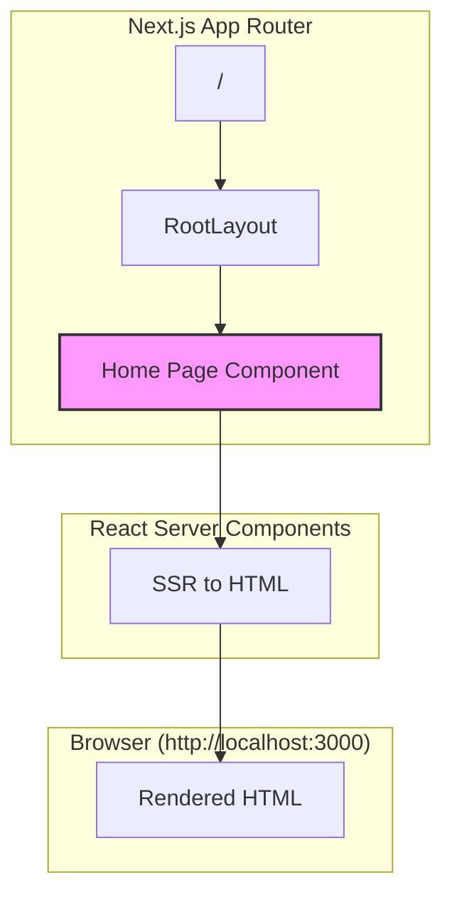
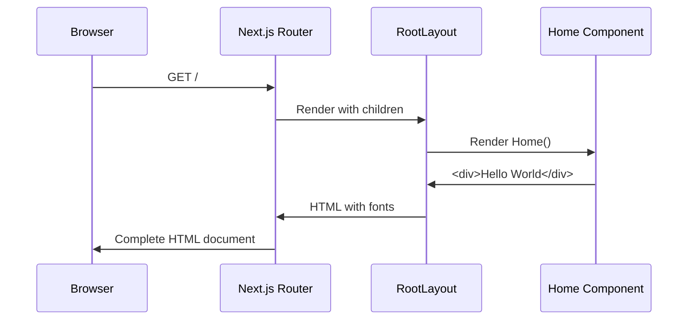

# Design: Hello World Page

## Overview
Replace 66-line Next.js starter page with minimal Server Component displaying "Hello World". Maintains default export pattern, TypeScript strict mode, inherits Geist fonts from RootLayout.

## Design Inputs
- **Architecture style**: Extend existing architecture
- **Additional context**: Proceed with minimal implementation

## Architecture



## Components

### Home Page Component
**Purpose**: Display "Hello World" as application baseline

**Responsibilities**:
- Render static text content
- Maintain Server Component pattern (no client JS)
- Inherit fonts/antialiasing from RootLayout

**Interface**:
```typescript
// app/page.tsx
export default function Home(): React.ReactElement
```

**Type Signature**:
```typescript
// Implicit return type from React.ReactElement
function Home(): JSX.Element {
  return <div>Hello World</div>;
}
```

## Data Flow



1. Browser requests root URL (`/`)
2. Next.js App Router matches to `app/page.tsx`
3. RootLayout wraps component with Geist fonts, antialiasing
4. Home component renders minimal JSX
5. Server-side render produces static HTML
6. Browser displays "Hello World"

## Technical Decisions

| Decision | Options Considered | Choice | Rationale |
|----------|-------------------|--------|-----------|
| Component type | Server Component vs Client Component | Server Component | Static content, no interactivity needed. Default in Next.js 16. |
| Markup structure | `<div>`, `<h1>`, `<main>` | `<div>` | Minimal requirement, not semantic landing page. |
| Styling | Tailwind classes, inline styles, unstyled | Unstyled | Requirements specify "basic text display", no styling needed. |
| Export pattern | Named vs default | Default | Next.js App Router requires default export for pages. |
| TypeScript annotation | Explicit return type vs implicit | Implicit | React component inference automatic, no strict mode violations. |

## File Structure

| File | Action | Purpose |
|------|--------|---------|
| app/page.tsx | Modify | Replace 66 lines with ≤10 line "Hello World" component |

**No files created or deleted.** Single file modification.

## Error Handling

| Error Scenario | Handling Strategy | User Impact |
|----------------|-------------------|-------------|
| Build failure from syntax error | Caught by TypeScript compiler | Developer sees build error, blocks deployment |
| Lint violation | Caught by ESLint | Developer sees lint error, blocks merge |
| Missing default export | Caught by Next.js at runtime | 404 error or build failure |
| Type error in strict mode | Caught by TypeScript compiler | Developer sees type error in build |

**No runtime error handling needed** - component is trivial static content.

## Edge Cases

- **Dark mode rendering**: Inherited from RootLayout (body applies `antialiased` class, no explicit dark mode styles in page)
- **Empty children**: Not applicable, component has no props
- **SSR hydration**: No client-side JS, no hydration needed
- **Font loading failure**: Handled by Next.js font optimization, falls back to system fonts

## Test Strategy

### Manual Verification
**No automated test infrastructure exists per research.md**

1. **Visual test**: Navigate to `http://localhost:3000` in browser
   - Verify "Hello World" text displays
   - Check both light and dark mode (system preferences)
   - Confirm no console errors

2. **Build validation**: `npm run lint && npm run build`
   - Lint passes with 0 errors
   - Build completes successfully
   - TypeScript strict mode validation passes

### Coverage
- **Unit tests**: N/A (no test infrastructure)
- **Integration tests**: N/A (no test infrastructure)
- **E2E tests**: Manual browser verification only

## Performance Considerations

- **Bundle size**: Reduction from 66 lines to ≤10 lines (~85% code reduction)
- **Zero client JS**: Server Component means no hydration overhead
- **Font loading**: Inherited optimization from RootLayout (Geist fonts loaded once)
- **No images**: Removes Next.js Image component and static assets from page

## Security Considerations

- **No user input**: Static content only
- **No external links**: Removes potential XSS vectors from starter links
- **Server Component**: No client-side JavaScript reduces attack surface

## Existing Patterns to Follow

Based on codebase analysis:
- **Default export function**: `export default function Home() { ... }` (layout.tsx pattern)
- **TypeScript implicit typing**: No explicit return type annotations (layout.tsx pattern)
- **Component naming**: PascalCase function name matching file purpose (`Home` for home page)
- **JSX structure**: Standard React 19 JSX syntax (`jsx: "react-jsx"` in tsconfig)
- **No "use client"**: Server Components default, directive not needed

## Implementation Steps

1. Open `/Users/aarony/city-council-transcripts/app/page.tsx`
2. Replace entire contents with minimal component:
   ```typescript
   export default function Home() {
     return <div>Hello World</div>;
   }
   ```
3. Save file (reduces from 66 lines to 3 lines)
4. Run `npm run lint` to verify ESLint compliance
5. Run `npm run build` to verify build succeeds and TypeScript validates
6. Start dev server with `npm run dev`
7. Open browser to `http://localhost:3000` and verify "Hello World" displays
8. Toggle system dark mode and verify text remains visible

**Expected outcome**: Clean baseline page, ≤10 lines, passes all quality gates.
